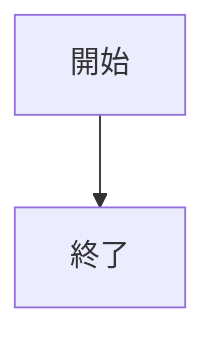
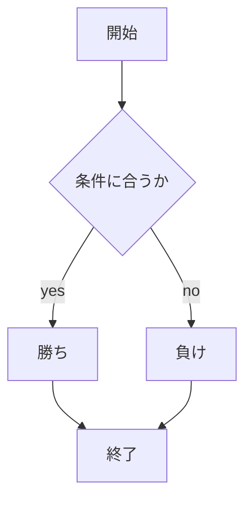

# webpro_06

## 目次

##### はじめに
1. [WebブラウザとWebサーバ](#anchor1)
1. [HTMLとEJS](#anchor2)
1. [バージョン管理方法](#anchor3)

##### プログラム
4. [じゃんけんのプログラム](#anchor4)
5. [あっち向いてホイのプログラム](#anchor5)
6. [カレンダーのプログラム](#anchor6)

<a id="anchor1"></a>

1. Web ブラウザと Web サーバ
    Web ブラウザと Web サーバ間の通信は，HTTP と呼ばれるプロトコルに基づいて行われており，クライアントである Web ブラウザからユーザの指示に従い，サーバに要求するプログラムが実行され，サーバ側は要求が来るまでずっと待ち続け，要求に合う応答を返すプログラムが実行されている．これらは静的なファイル転送である．しかし，現代の Web では，静的なファイル転送だけでなく，動的な Web システムを開発することが求められている．


<a id="anchor2"></a>

2. HTMLとEJS
    HTML と EJS はどちらも Web ページを構築する際に使われるが、役割や使い方が異なる．まず，HTML は Web ページの構造を記述するためのマークアップ言語であり，静的コンテンツを作成するのに適している．そのため，動的なデータを取り扱うことはできない．一方，EJS は HTML の中に埋め込み JavaScript コードを使うことができ，サーバーサイドで動的コンテンツを生成するために使用される．EJS は Node.js と組み合わせることで、動的な Web ページの生成を行うことができるが、静的なページの生成は HTML だけで可能である．


<a id="anchor3"></a>

2. バージョン管理方法
    - バージョン管理の必要性
    通常，プログラムを書き換えた際，どこをどのような目的で変更したかをすべて覚えておくことは難しい．また，変更するたびに新規ファイルを作っておくことも出来るが，管理が困難である．このような場合に，変更履歴をすべて記憶しておき必要に応じて遡れる,バージョン管理システムが必要である．
    - Githubでの管理方法
    分散型バージョン管理システムの一つに Git があり，Git リポジトリをオンラインでホスティングするサービスとして Github がある．
    Git で管理する際，誰が変更したかを明らかにするために，以下のコマンドでユーザ名とメールアドレスを設定する．この作業は1度だけ実行する必要がある．


<a id="anchor2"></a>

2. じゃんけんのプログラム
    - 機能
    このプログラムは，cpuに乱数で得た数字からグー，チョキ，パーの文字列を代入し，いずれかを出力させ，プレーヤーが選択したものと処理し，勝敗をつけるプログラムである．
    - プログラム
    始めに，


<a id="anchor3"></a>

3. じゃんけんのプログラム
    - 機能
    このプログラムは，cpuに乱数で得た数字からグー，チョキ，パーの文字列を代入し，いずれかを出力させ，プレーヤーが選択したものと処理し，勝敗をつけるプログラムである．
    - プログラム
    始めに，

<a id="anchor4"></a>

4. あっち向いてホイのプログラム
    1. おはようございます。
    1. こんにちは。
    1. こんばんは。

<a id="anchor5"></a>

5. 詳細
    1. 「おはようございます」とは  
    起床時、あるいは朝人に会った時の挨拶。
    1. 「こんにちは」とは  
    語源は「今日は、ご機嫌いかがですか？」が省略されたもの
    1. 「こんばんは」とは  
    語源は「今晩は〇〇ですね。」の後半部分が省略されたもの


表示のページがあるとよい
こちらを押すとゲームに行く
10.29

ファイル名 | 説明
-|-
app5.js | プログラムの本体
public\janken.html | じゃんけんの開始画面
views/janken.ejs | じゃんけんのテンプレートファイル


```javascript
console.log('Hello')
```

## 使用方法
1. ```node app5.js``` でプログラムを起動する
1. Webブラウザでlocalhost:8080/public/janken.htmlにアクセスする
1. 自分の手で入力する








<a id="anchor1"></a>

1. 概要
    - 日本の挨拶についてまとめる