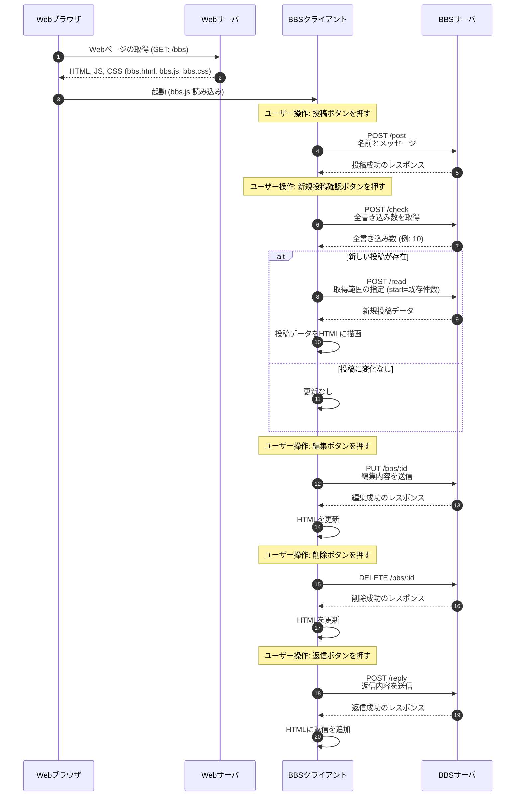

```mermaid
sequenceDiagram
  autonumber
  participant Browser as Webブラウザ
  participant Server as Webサーバ
  participant Client as BBSクライアント
  participant BBS_Server as BBSサーバ

  Browser ->> Server: Webページの取得 (GET: /bbs)
  Server -->> Browser: HTML, JS, CSS (bbs.html, bbs.js, bbs.css)
  Browser ->> Client: 起動 (bbs.js 読み込み)

  Note over Client: ユーザー操作: 投稿ボタンを押す
  Client ->> BBS_Server: POST /post<br>名前とメッセージ
  BBS_Server -->> Client: 投稿成功のレスポンス

  Note over Client: ユーザー操作: 新規投稿確認ボタンを押す
  Client ->> BBS_Server: POST /check<br>全書き込み数を取得
  BBS_Server -->> Client: 全書き込み数 (例: 10)

  alt 新しい投稿が存在
    Client ->> BBS_Server: POST /read<br>取得範囲の指定 (start=既存件数)
    BBS_Server -->> Client: 新規投稿データ
    Client ->> Client: 投稿データをHTMLに描画
  else 投稿に変化なし
    Client ->> Client: 更新なし
  end

  Note over Client: ユーザー操作: 編集ボタンを押す
  Client ->> BBS_Server: PUT /bbs/:id<br>編集内容を送信
  BBS_Server -->> Client: 編集成功のレスポンス
  Client ->> Client: HTMLを更新

  Note over Client: ユーザー操作: 削除ボタンを押す
  Client ->> BBS_Server: DELETE /bbs/:id
  BBS_Server -->> Client: 削除成功のレスポンス
  Client ->> Client: HTMLを更新

  Note over Client: ユーザー操作: 返信ボタンを押す
  Client ->> BBS_Server: POST /reply<br>返信内容を送信
  BBS_Server -->> Client: 返信成功のレスポンス
  Client ->> Client: HTMLに返信を追加
```