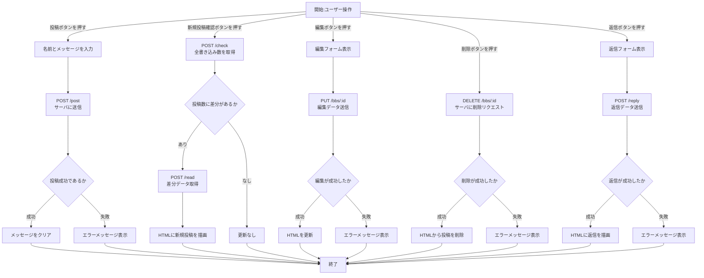

```mermaid
flowchart TD
  A[開始:ユーザー操作] -->|投稿ボタンを押す| B[名前とメッセージを入力]
  B --> C[POST /post<br>サーバに送信]
  C --> D{投稿成功であるか}
  D -->|成功| E[メッセージをクリア]
  D -->|失敗| F[エラーメッセージ表示]
  E --> Z[終了]
  F --> Z

  A -->|新規投稿確認ボタンを押す| G[POST /check<br>全書き込み数を取得]
  G --> H{投稿数に差分があるか}
  H -->|あり| I[POST /read<br>差分データ取得]
  I --> J[HTMLに新規投稿を描画]
  J --> Z
  H -->|なし| K[更新なし]
  K --> Z

  A -->|編集ボタンを押す| L[編集フォーム表示]
  L --> M[PUT /bbs/:id<br>編集データ送信]
  M --> N{編集が成功したか}
  N -->|成功| O[HTMLを更新]
  N -->|失敗| P[エラーメッセージ表示]
  O --> Z
  P --> Z

  A -->|削除ボタンを押す| Q[DELETE /bbs/:id<br>サーバに削除リクエスト]
  Q --> R{削除が成功したか}
  R -->|成功| S[HTMLから投稿を削除]
  R -->|失敗| T[エラーメッセージ表示]
  S --> Z
  T --> Z

  A -->|返信ボタンを押す| U[返信フォーム表示]
  U --> V[POST /reply<br>返信データ送信]
  V --> W{返信が成功したか}
  W -->|成功| X[HTMLに返信を描画]
  W -->|失敗| Y[エラーメッセージ表示]
  X --> Z
  Y --> Z

  Z[終了]


```